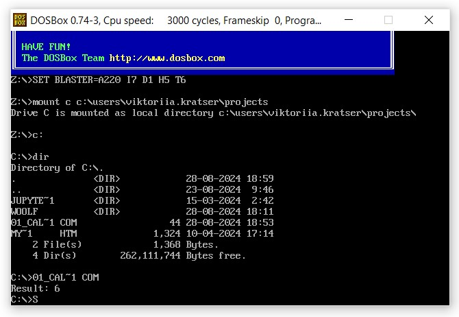
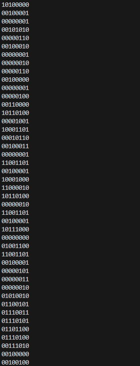

# woolf-cs-hw-01

### Завдання 01:

- Програма обчислює вираз b - c + a та виводить результат обчислення на екран.
- Зроблено та прикріплено скріншот вікна DOSBox із відображеним результатом виконання програми.



- відображення вмісту файлу у бінарному форматі:
```
Get-Content .\01_calculation.com -Encoding Byte | % { [Convert]::ToString($_, 2).PadLeft(8, '0') }
```


