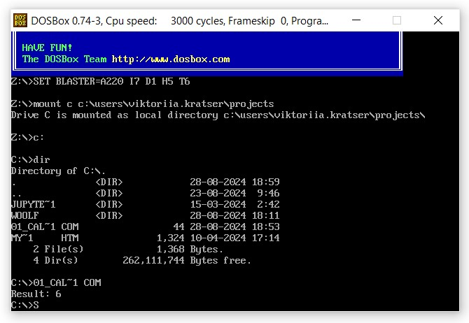
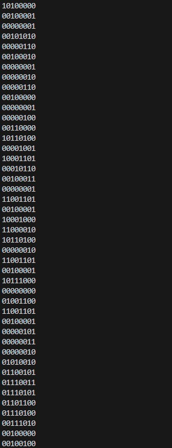
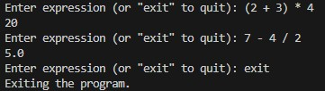

# woolf-cs-hw-01

### Завдання 01:

- Програма обчислює вираз b - c + a та виводить результат обчислення на екран.
- Зроблено та прикріплено скріншот вікна DOSBox із відображеним результатом виконання програми.



- відображення вмісту файлу у бінарному форматі:
```
Get-Content .\01_calculation.com -Encoding Byte | % { [Convert]::ToString($_, 2).PadLeft(8, '0') }
```



### Завдання 02:

- Додано нові типи токенів для операцій множення MUL, ділення DIV та дужок.

- Модифіковано метод get_next_token, щоб він розпізнавав нові символи.

- Модифіковано парсер Parser .

- Оновлено Інтерпретатор так, щоб він підтримував операції множення та ділення, обробляв вирази з дужками.

- Інтерпретатор працює.


